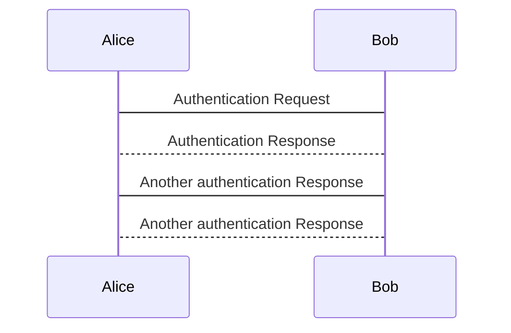

Because I always forget how to update this space...

<!--more-->

BTW, I use arch...

# Run now!

* `cd /PATH/TO/YOUR/JEKYLL/PROJECT`
<hr>
* **`bundle-2.7 exec jekyll serve`**
<hr>
- `ssh-agent -s`
- `$SSH_AUTH_SOCK="/tmp/ssh-XXXXXXHell0/agent.12345"`
- `$SSH_AGENT_PID=12345;`
<hr>
* `git add .`
* `git commit`
* `git push`


# Setup
## Install Ruby *2.7* + Jekyll
source: ArchLinux Forum » Newbie Corner » [Solved "bundle exec jekyll serve" crashes](https://bbs.archlinux.org/viewtopic.php?id=265534)

* **`sudo pacman -S ruby2.7`**
* `cd /PATH/TO/YOUR/JEKYLL/PROJECT`
**`bundle-2.7 install`**


## Github: create key

[Generating a new SSH key and adding it to the ssh-agent](https://docs.github.com/en/authentication/connecting-to-github-with-ssh/generating-a-new-ssh-key-and-adding-it-to-the-ssh-agent)

Start the ssh-agent in the background.

`eval "$(ssh-agent -s)"`
`Agent pid 59566`

Add your SSH private key to the ssh-agent.

`ssh-add ~/.ssh/id_ed25519`

## ssh-agent output
SSH_AUTH_SOCK=/tmp/ssh-XXXXXXOJAapU/agent.27281; export SSH_AUTH_SOCK;
SSH_AGENT_PID=27282; export SSH_AGENT_PID;
echo Agent pid 27282;

## ArchLinux
`gh` : alias / function to launch ss-agent and update environment variables!
```python
# SSH (Github) and virtual env helpers ----------------------------------------
def ssh_agent():
    import re
    if 'SSH_AUTH_SOCK' in ${...} and 'SSH_AGENT_PID' in ${...}:
        print("SSH_AUTH_SOCK = ", $SSH_AUTH_SOCK)
        print("SSH_AGENT_PID = ", $SSH_AGENT_PID)
	return

    ssh_agent_txt = $(ssh-agent -s)

    for export_env in ssh_agent_txt.split("\n"):
        param_value = list(filter(None, re.split("([^=]+)=([^;]+).*", export_env)))
        if len(param_value) == 2:
           ${param_value[0]} = param_value[1]
           print(param_value[0], " = ", param_value[1])

    ssh-add
    ssh-add ~/.ssh/id_rsa_github

aliases['gh'] = ssh_agent
aliases['vh'] = ['source-bash', './bin/activate']

```

# GitHub Flavored Markdown Spec

[https://github.github.com/gfm](https://github.github.com/gfm)

GitHub Flavored Markdown, often shortened as GFM, is the dialect of Markdown that is currently supported for user content.


# Test 2022

